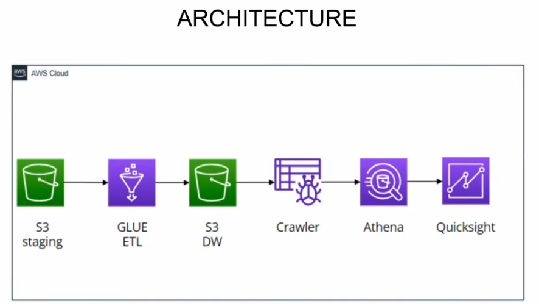
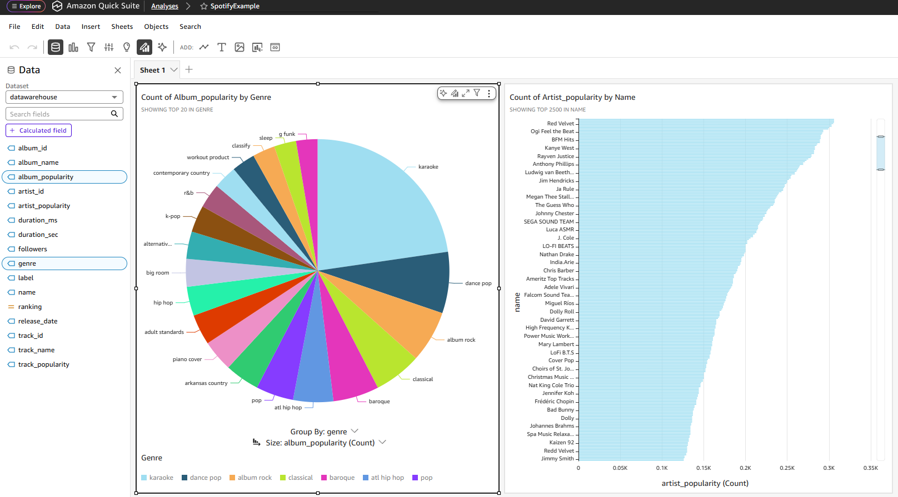

# 🎵 Spotify Analytics Project  
🚀 Beginner Project | AWS ETL Pipeline with Glue, Athena & QuickSight  

**Status:** ✅ Completed  

---

## 📄 Overview  

This project demonstrates an **end-to-end data pipeline** on AWS that extracts, transforms, and visualizes **Spotify data** for analytics and reporting.  

It follows the steps from [Darshil Parmar’s AWS Data Engineering Walkthrough](https://www.youtube.com/watch?v=yIc5a7C8aHs), recreated independently to reinforce key data engineering concepts.  

During implementation, I encountered and resolved a **permissions issue between Athena and QuickSight**, ensuring secure and successful data access for dashboard creation.  

The final solution leverages AWS-native services to build a **serverless and scalable** data workflow — from raw data ingestion to business insights visualization.

---

## 🏗️ Architecture Overview  

|  |
|:--:|
| *Spotify Analytics Pipeline Architecture* |

**Workflow Summary:**  
1. **S3 (staging)** — Raw data uploaded to the staging bucket.  
2. **AWS Glue (ETL)** — Data cleaning and transformation process.  
3. **S3 (data warehouse)** — Transformed data stored in structured format.  
4. **Crawler** — Automatically catalogs data for querying.  
5. **Athena** — Runs SQL queries on the processed data.  
6. **QuickSight** — Visualizes KPIs and trends for analysis.  

---

## 🧰 Tools & Technologies  

| Layer | AWS Services |
|-------|---------------|
| Data Storage | S3 |
| Data Transformation | Glue |
| Data Catalog | Glue Crawler |
| Query Engine | Athena |
| Visualization | QuickSight |

---

## 📊 Dashboard Preview  

|  |
|:--:|
| *Spotify Streaming Insights Dashboard (QuickSight)* |

---

## 🧠 Key Learnings  
- Built a **fully cloud-native ETL workflow** without local scripting.  
- Used **AWS Glue** to transform and manage data schemas efficiently.  
- Learned to query datasets with **Athena** and visualize metrics in **QuickSight**.  
- Overcame a **permissions integration challenge** between Athena and QuickSight.  
- Strengthened understanding of **data lake architecture** on AWS.  

---

## 🪜 Next Steps / Improvements  
- Automate Glue ETL job triggers with AWS Lambda or EventBridge.  
- Integrate more Spotify datasets (artists, playlists, or regions).  
- Add partitioning strategies in S3 for improved query performance.  

---

## 🙌 Acknowledgment  
Project inspired by [Darshil Parmar’s AWS Data Engineering Walkthrough](https://www.youtube.com/watch?v=yIc5a7C8aHs).  
